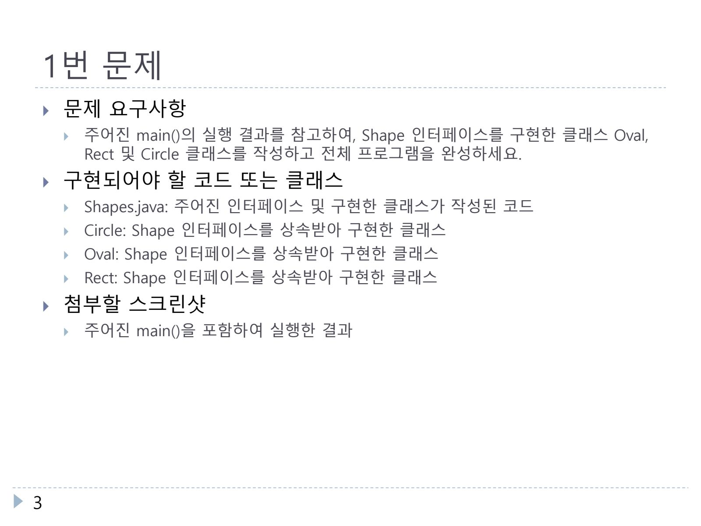
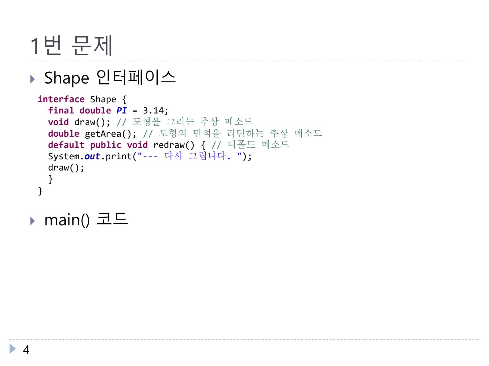
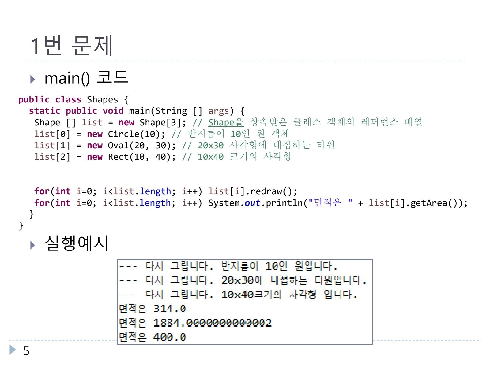
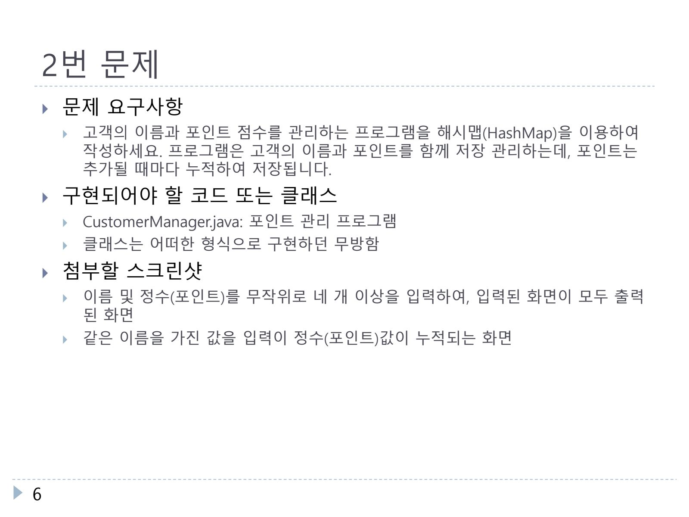
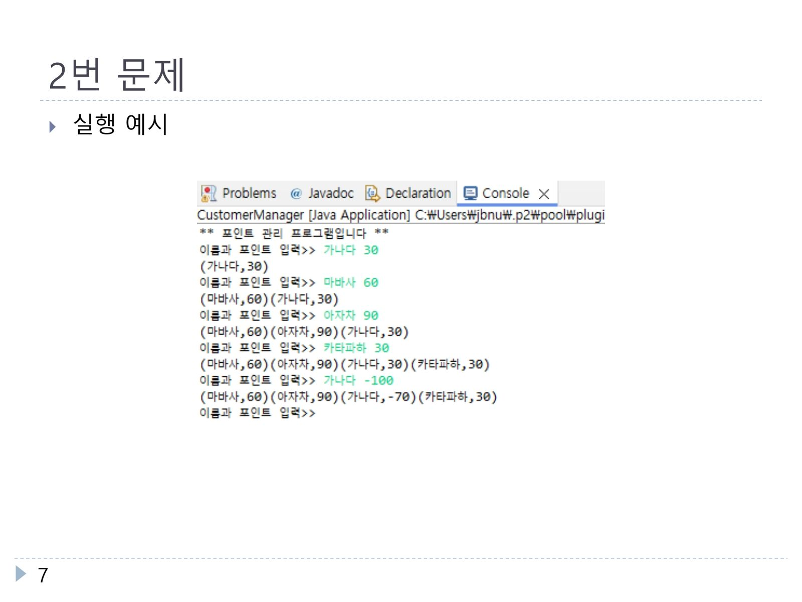
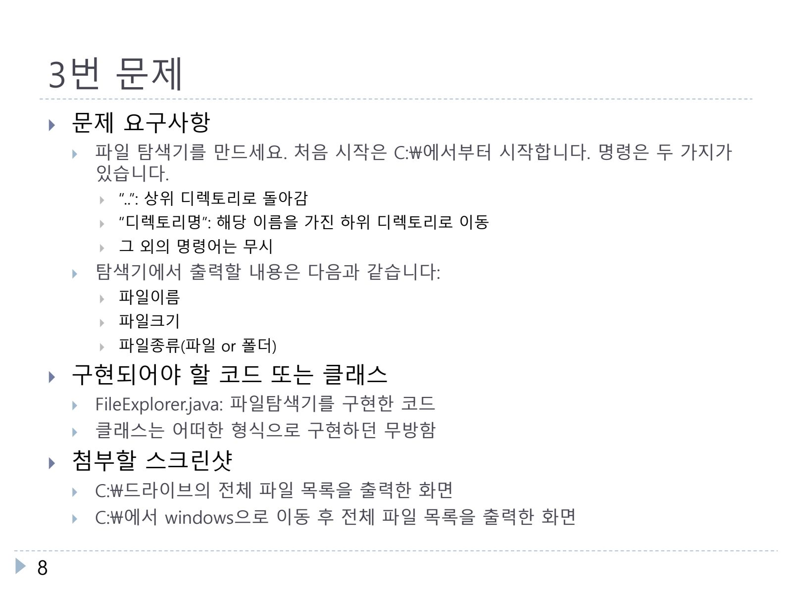
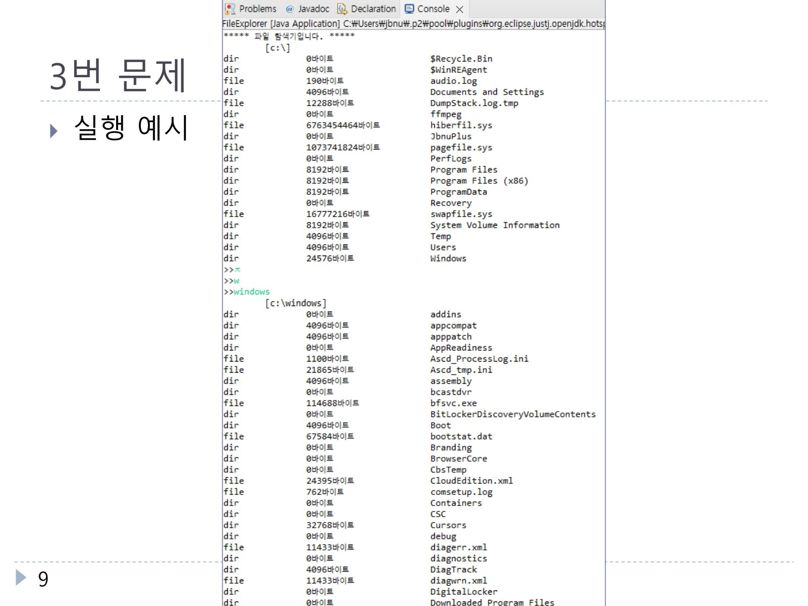
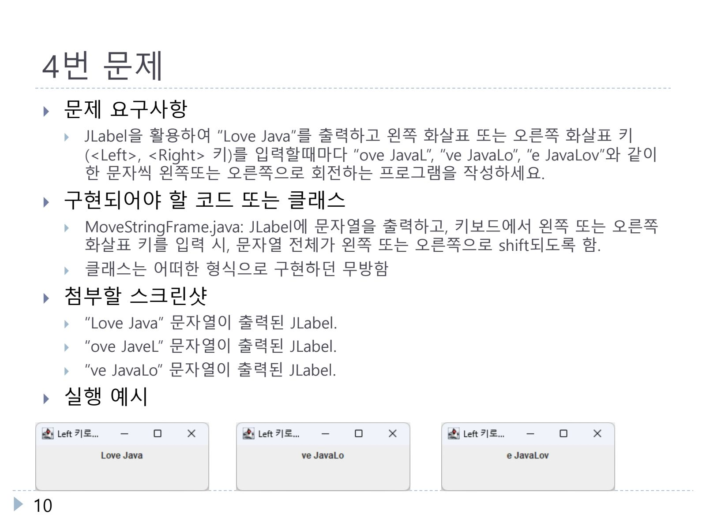
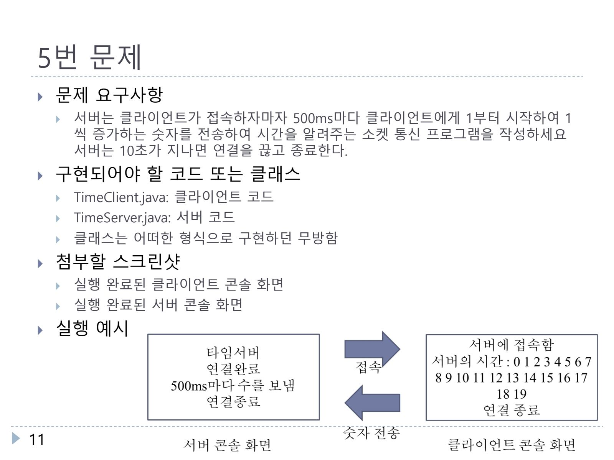

# jbnu-oop

2024년. 4학년 2학기. Object Oriented Programming. 객체지향프로그래밍.

## 1. Development

### 1-1. Summary

수업 간 객체지향프로그래밍(Java) 과제 모음.

### 1-2. Environment

Java

### 1-3. Detailed

#### 1-3-1. 1번 과제

#### 1-3-2. 2번 과제

#### 1-3-3. 3번 과제

#### 1-3-4. 4번 과제

#### 1-3-5. 5번 과제

